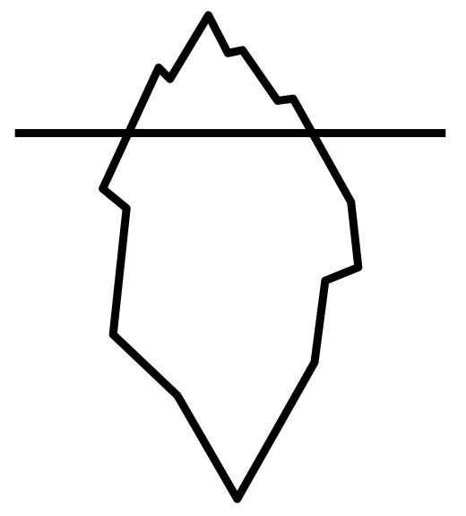

# O *iceberg* da ciência

 

Podemos comparar a nossa prática científica a um *iceberg*:  a parte de cima, a visível acima da linha d'água, são os artigos publicados, as apresentações em eventos, as bolsas e os auxílios aprovados. Mas para cada uma das conquistas visíveis há um conjunto muito maior de experiências que ficam emcobertas, abaixo da linha d'água do *iceberg*: os resultados negativos que não são reportados, os dados primários e secundários coletados e não publicados, as hipóteses equivocadas, as incertezas do pesquisador, assim como os atalhios práticos adotados para superar as dificuldades e o próprio fluxo da pesquisa.

O movimento Ciência Aberta visa trazer à tona a parte submersa do *iceberg* da pesquisa: é a prática na qual outros podem colaborar e contribuir, em que os dados de pesquisa, as anotações de laboratório e outros processos de pesquisa estão acessíveis, em condições que permitam o reuso, a redistribuição e a reprodução da pesquisa e de seus métodos subjacentes. 

Precisamos abrir a caixa preta (que na verdade é vermelha) dos dados!

## Dados **FAIR**

Em Ciência Aberta, os dados de pesquisa atendem ao acrônico do inglês *FAIR*: 

- **Achável** (*Findable*): Para ser localizado, qualquer conjunto de dados precissa ser identificável unicamente e persistentemente. O mesmo conjunto de dados precisa ser reencontrado em qualquer ponto no tempo, de modo persistente. Um conjunto de dados precisa deve incluir metadados básicos para ser distinguido de outros conjuntos de dados. Os identificadores precisam ser únicos e persistentes, como o DOI. 

- **Acessível** (*Accessible*): Dados acessíveis podem ser processados por máquinas e seres humanos, o que envolve a autorização de uso e questões éticas, bem como um protocolo definido de processamento, com glosas e rotinas detalhadas. 

- **Interoperável** (*Interoperable*): Conjuntos de dados interoperáveis são aqueles processáveis por máquina. Por isso, precisam utilizar etiquetas compartilhadas. Além disso, os dados dentro do cojunto de dados devem ser sintaticamente e semanticamente interpretáveis.

- **Reutilizável** (*Reusable*): Para serem reutilizados, além de atender aos princípios anteriores, os conjuntos de dados precisam ser suficientemente bem descritos para possibilitar a comparação con outros conjuntos de dados. Para garantir a autoria, conjunto de dados publicados devem se referir às fontes com metadados que permitam a citação adequada. 

## Repositórios para a Ciência Aberta

O movimento Ciência Aberta preconiza a abertura e a transparência na gestão dos conjuntos de dados de pesquisa. Isso significa a disponinilização de dados em repositórios públicos (não necessariamente abertos), a disponibilização de *scripts* de busca e de análise de dados, a publicação do projeto e das hipóteses (ou protocolo de registro de pré-análise).

Para a disponibilização deste conjuntos, as plataformas [Open Science Framework](https://osf.io) e [Figshare](https://figshare.com) são as mais conhecidas e aderentes aos princípios do movimento Ciência Aberta. Além disso, ao registrar o projeto e armazenar os conjuntos de dados nestas plataformas, é possível atribuir um DOI a cada produto científico, possibilitando a citação e o compartilhamento. 

A disponibilização de conjuntos de dados, scripts de análise e do projeto de pré-análise tem sido requisitada nas publicações científicas, como uma forma de possibilitar a replicabilidade da pesquisa científica, e, assim, contribuir para reverter a crise na ciência. 

## As publicações científicas e o movimento Ciência Aberta

Os efeitos da ciência aberto também se verificam no fluxo da divulgação científica, mais especificamente com a revisão aberta e a publicação de *pre-prints*.

O modelo de avaliação tradicionalmente adotado nas revistas científicas é o duplo cego, o que significa que o autor não sabe quem são os pareceristas e os pareceristas não sabem quem são os autores. Na teoria, o sistema funciona. Mas na prática, muitas vezes a especificidade do estudo faz com que rapidamente pareceristas suspeitem quem sejam os autores do manuscrito em avaliação, assim como o tipo de sugestão e encaminhamentos apresentados nos pareceres leva os autores a suspeitar da identidade de quem foi o parecerista. 
A abertura do processo, ou seja, autores e pareceristas sabem quem é quem, evita o desconforto das suspeitas e ao mesmo tempo possibilita um trabalho colaborativo de verdadeira construção da ciência, ao valorizar a contribuição do parecerista. 

Embora demandem tempo e esforço, pareceres resultantes do processo de avaliação duplo cego são produtos acadêmicos pouco valorizados por conta do anonimato, que impossibilita sua publicação. Muitas vezes a contribuição de um parecer é substancial na condução de uma linha de análise ou de argumentação em um artigo científico, e quem despendeu esforço e tempo para contribuir com o amadurecimento da pesquisa recebe, no máximo, uma nota de agradecimento genérica. A publicação dos pareceres e o reconhecimento nominal dá visibilidade e valoriza o trabalho do parecerista, além de elevar a qualidade da produção científica. Como editora chefe da [Revista da Abralin](https://revista.abralin.org/index.php/abralin), que em 2020 adotou o processo de revisão aberta pioneiramente na área de Linguística no Brasil, posso atestar que a mudança elevou a qualidade não só dos pareceres, mas também das submissões (o anonimato, de certa forma, protege faces), além de reduzir o tempo no fluxo editorial e contar com discussões que promoveram o aprimoramento significativo das ideias dos artigos, com o devido reconhecimento das contribuições dos pareceristas. 

Uma outra forma de revisão aberta, mas anterior ou paralela ao processo editorial, é a publicação de um manuscrito em um repositório de *pre-prints*. 

Um *pre-print* é um manuscrito que, antes de passar por um processo de avaliação de pares em um periódico, é compartilhado em um repositório temático para acesso ao público. Em outras palavras, é uma revisão aberta pública: qualquer pessoa pode contribuir com o manuscrito, publicando seu parecer. Com este procedimento, os manuscritos podem passar por uma pré-avaliação antes de serem submetidos ao processo editorial de um periódico, o que permite correções e novas versões do mesmo texto à medida que as contribuições são incorporadas.
Outra vantagem do deposito em um repositório de *pre-prints* é a celeridade na publicação de resultados; por exemplo, em meio à pandemia de COVID-19, as demandas por acesso a resultados não podem esperar os quatro a seis meses em média de tempo de processo por todo o fluxo editorial em um periódico.
Nem todas as revistas aceitam submissões de artigos que estejam depositadas em repositórios de *pre-prints* e não é qualquer manuscrito que é aceito em um repositório: por isso, é importante antes checar tanto a política do periódico (quando aceitam *preprints*, é necessário informar o identificador de acesso no repositório) quanto a do repositório (que pode ter exigências quanto à língua da publicação ou temática).

O [Scielo](https://preprints.scielo.org/index.php/scielo) tem um repositório de *preprints* preferencialmente para manuscritos submetidos às revistas vinculadas. E o [PsyArXIv](https://psyarxiv.com) é um repositório da área da psicologia que também aceita a submissão de manuscritos da área de linguística.

## Política de Estado

As diretrizes do movimento Ciência Aberta encontram amparo no [**4^o^ Plano de Ação Nacional sobre Governo Aberto**](https://www.gov.br/cgu/pt-br/governo-aberto/a-ogp/planos-de-acao/4o-plano-de-acao-brasileiro/4o-plano-de-acao-nacional_portugues.pdf),  que estabece compromissos para a inserção de iniciativas, ações, projetos, programas e políticas públicas inovadoras, e, especificamente no campo da ciência e inovação, visa estabelecer mecanismos de governança de dados científicos para o avanço da ciência aberta no Brasil.

Um destes mecanismos é o [*Lattes Data*](http://www.ibict.br/sala-de-imprensa/noticias/item/1952-ibict-e-cnpq-assinam-acordo-de-cooperacao-para-o-repositorio-lattes-data), uma expansão da Plataforma Lattes com o objetivo de armazenar e permitir acesso aos dados de projetos fomentados pelo CNPq, permitindo compartilhamento e reuso pela comunidade científica e acompanhamento pela sociedade. 

Outras instituições de pesquisa brasileiras também se comprometem com os princípios de Ciência Aberta. O Instituto Serrapilheira publicou um [Guia de boas práticas em ciência aberta e reprodutível](https://olz34z4bb51rsojq274o1g19-wpengine.netdna-ssl.com/wp-content/uploads/2019/11/serrapilheira-guia_ciencia_aberta-e-reprodutivel.pdf) com orientações mais detalhadas e complementares a estas que compartilho aqui. A [FAPESP](http://www.fapesp.br/openscience/) apresenta suas diretrizes de Ciência Aberta e divulga suas iniciativas e outras experiências no mundo. 

