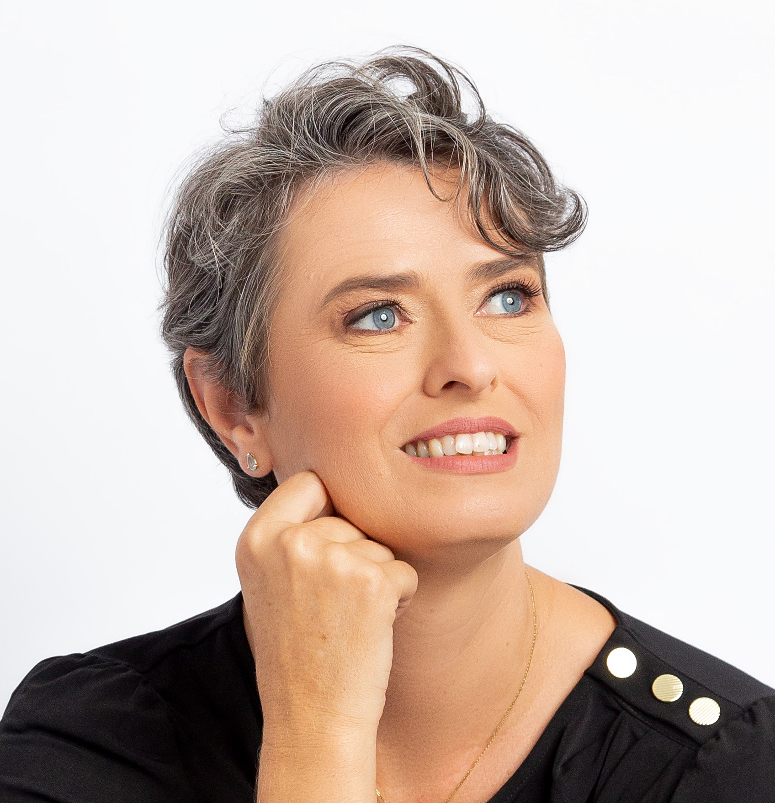

 

[<i class="fa fa-twitter" aria-hidden="true"></i>](https://twitter.com/rkofreitag) 
[<i class="fa fa-facebook" aria-hidden="true"></i>](https://www.facebook.com/raquel.freitag)
[<i class="fa fa-instagram" aria-hidden="true"></i>](https://www.instagram.com/raquel_freitag/)

Sou graduada, mestre e doutora em Linguística, pela Universidade Federal de Santa Catarina. Desde 2007, sou professora da Universidade Federal de Sergipe. Sou professora titular do Departamento de Letras Vernáculas, atuo nos programas de pós-graduação de Letras (profissional e acadêmico) e Psicologia.

Coordeno o Laboratório Multiusuário de Informática e Documentação Linguística - LAMID.

Já fui secretária da Associação Sergipana de Ciência, vice-presidente do Grupo de Estudos Linguísticos do Nordeste e da Associação Brasileira de Linguística. Hoje sou coordenadora do Comitê de Assessoramento de Letras e Linguística no CNPq.

Gosto de plantas, coleciono conchas e sou mãe de Gabriel.

