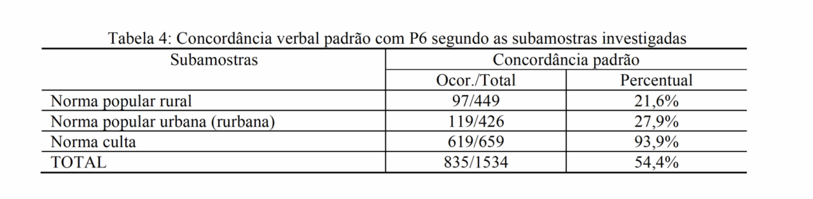
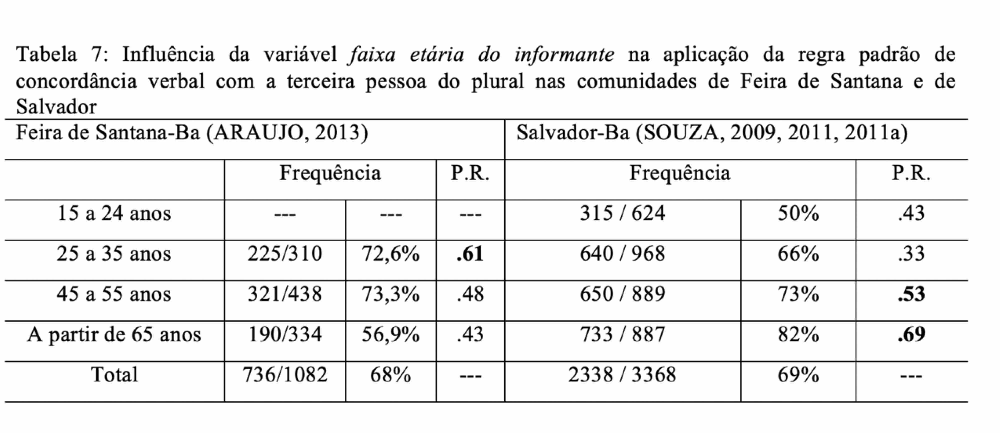
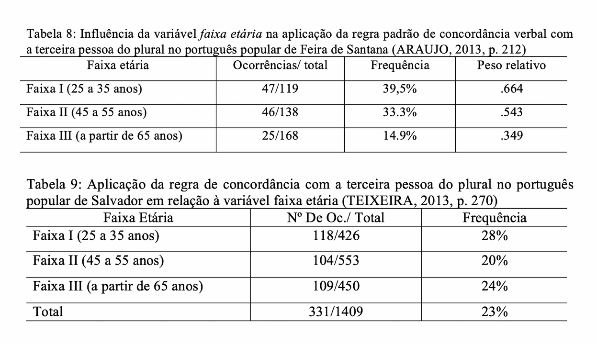
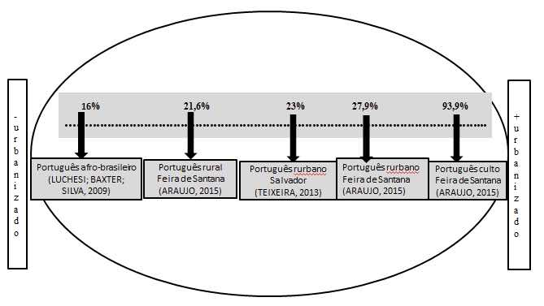

```{r setup, include = FALSE}
knitr::opts_chunk$set(
  collapse = TRUE,
  comment = "#>", 
  echo = TRUE
)
```

## Replicabilidade na ciência

A ciência vive uma crise generalizada em função da baixa replicabilidade de resultados ou de estudos. Há várias causas para essa crise, uma delas é a falta de clareza de procedimentos de análise dos dados, Como consequência, o poder explanatório das análises e da generalização dos resultados são limitados.

A não explicitação de todos os procedimentos realizados na análise e estatísticas reportadas parcialmente ou apenas quando conveniente são problemas recorrentes nos estudos, o que tornam uma meta-análise muito difícil de ser realizada.

A meta-análise é um procedimento em que são reunidos resultados de estudos com  diferentes conjuntos de dado sobre determinado fenômeno e são aplicadas técnicas estatísticas para explicar a variância dos resultados a partir de fatores comuns aos estudos. 

Uma vantagem em um estudo de meta-análise é eliminar viéses da revisão da literatura narrativa, em que são reportados resultados de estudo independentemente. Ao integrar as análises, o poder explanatório aumenta.

Vamos explorar neste tutorial algumas estratégias para produzir uma meta-análise, considerando um cenário em que estudos são independentes e com resultados estatísticos reportados apenas parcialmente. 

## Concordância verbal

A concordância verbal no português brasileiro é um fenômeno amplamente estudado, que tem apresentado resultados convergentes em relação aos condicionamentos internos (saliência fônica, posição), mas diversificados social e dialetalmente. A diversidade tem sido explicada como  resultado das diferentes sócio-histórias do português brasileiro. Mas também decorre das diferentes tipologizações dos condicionamentos e por viéses de amostragem.

Vamos examinar os resultados reportados em uma primeira versão de um texto, em que é apresentada uma revisão narrativa da concordância verbal em duas comunidades de fala da Bahia, e aprender a realizar uma meta-análise dos estudos, objeto da segunda versão do texto (em preparação).

```{r fig2, out.width = "600px", echo=FALSE}

```

A tabela 2 apresenta a contagem das ocorrências do fenômeno em função do tipo de subamostra. A variável dependente é a realização da concordância, uma variável categórica nominal, e os resultados estão apresentados apenas em função do valor escolhido como *default*, no caso, a realização padrão. A variável independente é o tipo de amostra, com três níveis, "norma popular rural", "norma popular urbana" e "norma culta". 

Os percentuais não nos permitem inferências. Um teste inferencial que pode ser realizado é o teste de qui-quadrado, que tem por objetivo verificar se a frequência absoluta observada de uma variável é significativamente diferente da distribuição de frequência absoluta esperada.

Um teste simples que pode ser realizado sem muita dificuldade é o teste aproximado para independência entre as proporções:

```{r proptest}
aplicacao = c(97, 119, 619)
total = c(449, 436, 659)
prop.test(aplicacao, total, correct = TRUE)
```

Se os valores foram digitados corretamente, as proporções apresentadas devem corresponder aos percentuais da tabela. O teste sugere que a distribuição entre as proporções é diferente da hipótese nula (p > 0.001).

### Como fazer um teste de qui-quadrado a partir de uma tabela?

- Informar as variáveis em dois vetores:
  + Um vetor será nomeado de `VD` e listará os níveis da variável dependente;
  + O outro de `VI` e listará os níveis da variável independente
- Listar as contagens de cada nível da variável independente, seguindo a ordem da variável dependente em vetores em uma matriz `data.matrix` que serão unidos pela função `rbind` no objeto `dadosP6`.
- Vincular os nomes das variáveis:
   + Variável dependente = `colnames`
   + Variável independente = `rownames`

```{r matriz1}
VD <- c("concordância", "não concordância")
VI <- c("Norma popular rural", "Norma popular urbana", "Norma culta")
dadosP6 <- data.matrix(rbind(
  c(97, 352),
  c(119, 307),
  c(619, 40)
))
rownames(dadosP6) <- VI
colnames(dadosP6) <- VD
```

Se todos os procedimentos estiverem corretos, você terá um objeto:
```{r matriz2}
dadosP6
```

Vamos inspecionar visualmente este objeto, construindo um gráfico de barras:
```{r bar1, fig.height = 3, fig.width = 6, fig.align = "center"}
dadosP6.t = t(dadosP6)      ### Transpor a matriz (colunas em linhas e linhas em colunas)
barplot(dadosP6.t,
        beside = TRUE,      ### Barras lado a lado
        legend = TRUE,
        main = "Frequências da concordância em P6 \n em função do tipo de amostra",
        ylim = c(0, 700),   ### Ajustar o eixo y para o máximo de ocorrências
        cex.names = 0.8,  ### Tamanho do texto das colunas
        cex.axis = 0.8,   ### tamanho do texto dos eixos
        args.legend = list(x   = "topleft",   ### Posição da legenda
                           cex = 0.8,          ### Tamanho do texto da legenda
                           bty = "n"))
```

Podemos ver que há uma diferença de distribuição entre os níveis da variável independente.Para confirmar se esta distribuição observada é signficativamente diferente da esperada, realizamos o teste de qui-quadrado:

```{r matriz3}
chisq.test(dadosP6)
```

O efeito da dependência é estatisticamente significativo.  Podemos descobrir o quanto cada nível contribui para essa associação. Para isso, precisamos investigar os *resíduos*, ou seja, a diferença entre a frequência observada e a frequência esperada em cada célula. 

```{r matriz4}
resultadoP6 <- chisq.test(dadosP6)
round(resultadoP6$residuals, 3)
```

O sinal dos resíduos é importante para interpretar a associação entre as linhas e as colunas, ou entre a variável dependente e independente. Podemos visualizar melhor os resíduos por meio de uma matriz de correlação, com  o pacote `corrplot`:

Podemos visualizar melhor os resíduos por meio de uma matriz de correlação, com  o pacote `corrplot`:
```{r matriz5, fig.height = 3, fig.width = 6, fig.align = "center"}
library(corrplot)
corrplot(resultadoP6$residuals, is.cor = FALSE)
```

Nesta matriz de correlação, ou correlograma, o tamanho do círculo é proporcional à contribuição da célula para o efeito.

- Resíduos positivos estão em azul e sinalizam uma associação positiva entre linha e coluna.
- Resíduos negativos estão em vermelho e sinalizam uma associação negativa entre linha e coluna. 

Podemos calcular o quanto cada célula contribui para o total do escore de qui-quadrado e dispor no correlograma:
```{r, matriz6, fig.height = 3, fig.width = 6, fig.align = "center"}
contrib <- 100*resultadoP6$residuals^2/resultadoP6$statistic
round(contrib, 3)
corrplot(contrib, is.cor = FALSE)
```

O nível "norma culta"' é o que mais contribui para o resultado do teste. 

### Como fazer um teste de regressão a partir de uma tabela?

Primeiro, precisamos desfazer a tabela, retornando as ocorrências, para poder realizar uma análise de regressão. O preparo dos dados requer a conversão em um objeto `data.frame.table` e depois utilizar uma função que transforma as contagens em ocorrências `counsToCases`.

```{r contagem}
dados <- as.data.frame.table(dadosP6) ### converter a matriz em um data.frame
countsToCases <- function(x, countcol = "Freq") {  ###converter as contagens em ocorrências
  idx <- rep.int(seq_len(nrow(x)), x[[countcol]])
  x[[countcol]] <- NULL
  x[idx, ]
}
dados <- countsToCases(as.data.frame(dados))
names(dados) <- c("VI", "VD")  ## renomeando as colunas 
dados$VI <- factor(dados$VI, levels =c("Norma popular urbana", "Norma culta", "Norma popular rural")) ## reordenando os níveis
head(dados)  ##observar as 6 primeiras linhas
```

Agora os dados estão distribuídos por ocorrências, e não mais por contagem. Podemos realizar um outro tipo de teste, uma regressão logística generalizada (*retome o material das outras aulas*).

Vamos construir um modelo de regressão considerando que variável dependente é categórica nominal binária (com concordância ou sem concordância, em termos binários, 1 ou 0) e a variável preditora é também categórica. 

```{r modelo1}
modP6 <- glm(VD ~ VI, data = dados, family = "binomial")
summary(modP6)
```
> Um resultado  *2.2e-16* está em notação científica e significa *2.2 x 10_-16_*, ou seja,  **0.00000000000000022**, 15 zeros antes do ponto decimal.

A interpretação dos resultados considera o fato de que as chances de realização da variável são concordância ou não concordância.

O log das chances é uma função dos coeficientes estimados: *P(ocorrer)/P(ocorrer) = β~0~ + β~1~x~1~ + β~2~x~2~ + ... + β~n~x~n~* em que *P* significa probabilidade de (ocorrer/não ocorrer), *β~0~* é o intercepto, ponto do eixo em que a curva toca, *β~1~* é o coeficiente das variáveis preditoras.

A tabela de coeficientes nos mostra uma estimativa para cada coeficiente (*β*)  para o  modelo de regressão logística. O coeficiente de uma variável preditora categórica é a mudança estimada no log natural das chances com o nível de referência o nível de coeficiente. Por padrão, os níveis são ordenados pela ordem alfabética (a mudança  na ordem dos níveis do fator pode ser feita). 

Coeficientes positivos indicam que o evento torna-se mais provável e coeficientes negativos indicam que o evento torna-se menos provável. 

No exemplo, o nível de referência do intercepto é a realização *com concordância* e  *norma urbana popular*. Na mudança de nível, o coeficiente  para a ocorrência de *não concordância* na norma culta aumenta o log natural das chances em - 3.687 em relação à *norma popular urbana*, enquanto para a *norma popular rural* aumenta em *0.3412* em relação à *norma popular urbana*.

O valor do coeficiente não é em probabilidades, mas sim em log das razões de chance (log-odds). 

>  + Probabilidade: valor entre  0 e 1
	+ Razão de chances (odds): valor de 0 ao ∞
	+  Log de razão de chances (log-odds): de −∞ a ∞

Os resultados em log-odds permitem a comparação da magnitude dos coeficientes.

**O que observar:**

  - A ordem dos níveis das variáveis na saída (se não houve mudança, a ordenação dos níveis segue a ordem alfabética;
  - Os sinais dos coeficientes: se positivos ou negativos;
  - A magnitude dos coeficientes: a diferença entre eles;
  - O p-valor: a probabilidade que mede a evidência contrária à hipótese nula. P-valor baixo é uma forte evidência contra a hipótese nula.

Podemos visualizar os resultados do modelo em gráfico, utilizando o pacote `ggstats`.
```{r grafico, fig.height = 3, fig.width = 6, fig.align = "center"}
library(ggstatsplot)
ggstatsplot::ggcoefstats(x = modP6, exclude.intercept = FALSE, output = "plot")
```
Nesta visualização, os resultados estão em log-odds (de −∞ a ∞).

Outra forma de visualização em gráfico pode ser produzida com o pacote `sjPlot`. Vejamos como ficam os resultados em razão de chances (odds):
```{r grafico2, fig.height = 3, fig.width = 6, fig.align = "center"}
library(sjPlot)
plot_model(modP6)
```
Embora "digam a mesma coisa", os resultados em log-odds permitem observar a magnitude do efeito, daí por ser a forma preferível de reportar o resultado de um modelo de regressão generalizado.

Podemos também dispor os resultados em uma tabela formatável, com o pacote `sjlabelled`.
```{r tabela}
library(sjlabelled)
tab_model(modP6, transform = NULL, auto.label = FALSE)
```

Como vimos, o teste do qui-quadrado, com a observação dos resíduos, apontou a contribuição do nível *norma culta*; o modelo de regressão construído explica de forma mais específica a atuação deste nível, estimando em log-odds a magnitude do efeito deste nível da variável independente na realização da variável dependente. 

Os procedimentos para a análise univariada podem ser reproduzíveis mesmo sem se ter acesso ao conjunto de dados original. Este recurso pode auxiliar na produção de estudos de meta-análise, ao suprir resultados estatísticos nem sempre acessíveis e reportados nos estudos originais.

### Como comparar estudos com conjuntos de dados distintos?

A direção do fenômento de variação na concordância verbal na terceira pessoa é a mesma em comunidades de fala distintas?  Podemos responder a esta questão a partir de resultados apresentados em estudos anteriores, seguindo os procedimentos explicados anteriormente, e depois podemos proceder a uma meta-análise.

#### Concordância verbal na fala de Salvador e de Feira de Santana

Vamos realizar os procedimentos para comparar os resultados de Araujo (2013), concordância de terceira pessoa em função da idade em Feira de Santana, e de Souza (2011), concordância de terceira pessoa em função da idade em Salvador.

```{r fig4, out.width = "600px", echo=FALSE}

```

O teste aproximado para independência entre as proporções pode ser calculado:
```{r compara}
prop.test(x = c(736, 2338), n = c(1082, 3368))
```

O resultado não considera o efeito dos níveis da variável independente faixa etária, que foi controlada de maneira diferente nos dois estudos. Precisamos realizar análises univariadas para cada conjunto de dados e depois reuni-los.

Começamos por Feira de Santana:

- Importar o conjunto de dados:
```{r idade_feira1}
VD <- c("concordância", "não concordância")

VI <- c("25 a 35 anos", "45 a 55 anos", "mais de 65 anos")
dadosP6id <- data.matrix(rbind(
  c(225, 85),
  c(321,117),
  c(190, 144)
))
rownames(dadosP6id) <- VI
colnames(dadosP6id) <- VD
```

- Realizar teste de qui-quadrado e observar os resíduos:
```{r idade_feira2, fig.height = 3, fig.width = 6, fig.align = "center"}
resultadoP6id <- chisq.test(dadosP6id)
resultadoP6id
corrplot(resultadoP6id$residuals, is.cor = FALSE)
contrib <- 100*resultadoP6id$residuals^2/resultadoP6id$statistic
round(contrib, 3)
corrplot(contrib, is.cor = FALSE)
```
- Converter as contagens em ocorrências:
```{r idade_feira3}
dados <- as.data.frame.table(dadosP6id)
dados <- countsToCases(as.data.frame(dados))
names(dados) <- c("VI", "VD") 
head(dados)
```
- Construir o modelo de regressão:
```{r idade_feira4, fig.height = 3, fig.width = 6, fig.align = "center"}
modP6fs <- glm(VD ~ VI, data = dados, family = "binomial")
summary(modP6fs)
ggstatsplot::ggcoefstats(x = modP6fs, output = "plot")
```

Agora, vamos realizar os mesmos procedimentos para Salvador:

- Importar o conjunto de dados:
```{r salvador}
VD <- c("concordância", "não concordância")
VI <- c("15 a 24 anos", "25 a 35 anos", "45 a 55 anos", "mais de 65 anos")
dadosP6ssa <- data.matrix(rbind(
  c(315, 309),
  c(640,328),
  c(650, 239),
  c(733, 154)
))
rownames(dadosP6ssa) <- VI
colnames(dadosP6ssa) <- VD
```
- Realizar teste de qui-quadrado e observar os resíduos:
```{r salvador2, fig.height = 3, fig.width = 6, fig.align = "center"}
resultadoP6ssa <- chisq.test(dadosP6ssa)
resultadoP6ssa
corrplot(resultadoP6ssa$residuals, is.cor = FALSE)
contrib <- 100*resultadoP6ssa$residuals^2/resultadoP6ssa$statistic
round(contrib, 3)
corrplot(contrib, is.cor = FALSE)
```

- Converter as contagens em ocorrências:

```{r salvador3}
dados <- as.data.frame.table(dadosP6ssa)
dados <- countsToCases(as.data.frame(dados))
names(dados) <- c("VI", "VD") 
head(dados)
```
- Construir o modelo de regressão:
```{r salvador4, fig.height = 3, fig.width = 6, fig.align = "center"}
modP6ssa <- glm(VD ~ VI, data = dados, family = "binomial")
summary(modP6ssa)
ggstatsplot::ggcoefstats(x = modP6ssa, output = "plot")
```

Podemos visualizar os dois modelos lado a lado em uma única tabela:
```{r tabela2}
library(sjlabelled)
tab_model(modP6fs, modP6ssa, transform = NULL)
```

Agora, vamos considerar os resultados para a fala popular de Feira de Santana e Salvador, também considerando a idade.
```{r fig5, out.width = "600px", echo=FALSE}

```

O teste aproximado para independência entre as proporções pode ser calculado:
```{r compara2}
prop.test(x = c(118, 331), n = c(425, 1409))
```

- *O estudo de Araújo (2013) não fornece a linha de totais, o que requer usar a calculadora - sempre informe a linha de totais!*

Vamos repetir os mesmos procedimentos anteriores para cada um dos conjuntos de dados. Começamos por Feira de Santana.

- Importar o conjunto de dados:
```{r feirapop}
VD <- c("concordância", "não concordância")
VI <- c("25 a 35 anos", "45 a 55 anos", "mais de 65 anos")
dadosP6fspop <- data.matrix(rbind(
  c(47, 72),
  c(46, 92),
  c(25, 143)
))
rownames(dadosP6fspop) <- VI
colnames(dadosP6fspop) <- VD
```
- Realizar teste de qui-quadrado e observar os resíduos:
```{r feirapop2, fig.height = 3, fig.width = 6, fig.align = "center"}
resultadoP6fspop <- chisq.test(dadosP6fspop)
resultadoP6fspop
corrplot(resultadoP6fspop$residuals, is.cor = FALSE)
contrib <- 100*resultadoP6fspop$residuals^2/resultadoP6fspop$statistic
round(contrib, 3)
corrplot(contrib, is.cor = FALSE)
```

- Converter as contagens em ocorrências:

```{r feirapop3}
dados <- as.data.frame.table(dadosP6fspop)
dados <- countsToCases(as.data.frame(dados))
names(dados) <- c("VI", "VD") 
```
- Construir o modelo:
```{r feira5, fig.height = 3, fig.width = 6, fig.align = "center"}
modP6fspop <- glm(VD ~ VI, data = dados, family = "binomial")
summary(modP6fspop)
ggstatsplot::ggcoefstats(x = modP6fspop, output = "plot")
```

Idem para Salvador (Teixeira, 2013).

- Importar o conjunto de dados:
```{r salvadorpop}
VD <- c("concordância", "não concordância")
VI <- c("25 a 35 anos", "45 a 55 anos", "mais de 65 anos")
dadosP6ssapop <- data.matrix(rbind(
  c(118, 308),
  c(104, 449),
  c(109, 341)
))
rownames(dadosP6ssapop) <- VI
colnames(dadosP6ssapop) <- VD
```
- Realizar teste de qui-quadrado e observar os resíduos:
```{r salvadorpop2, fig.height = 3, fig.width = 6, fig.align = "center"}
resultadoP6ssapop <- chisq.test(dadosP6ssapop)
resultadoP6ssapop
corrplot(resultadoP6ssapop$residuals, is.cor = FALSE)
contrib <- 100*resultadoP6ssapop$residuals^2/resultadoP6ssapop$statistic
round(contrib, 3)
corrplot(contrib, is.cor = FALSE)
```

- Converter as contagens em ocorrências:

```{r salvadorpop3}
dados <- as.data.frame.table(dadosP6ssapop)
dados <- countsToCases(as.data.frame(dados))
names(dados) <- c("VI", "VD") 
```
- Construir o modelo:
```{r salvadorpop4, fig.height = 3, fig.width = 6, fig.align = "center"}
modP6ssapop <- glm(VD ~ VI, data = dados, family = "binomial")
summary(modP6ssapop)
ggstatsplot::ggcoefstats(x = modP6ssapop, output = "plot")
```
Novamente, podemos sumarizar os modelos em uma mesma tabela:
```{r tabela3}
library(sjlabelled)
tab_model(modP6fspop, modP6ssapop, transform = NULL)
```

## Meta-análise

Como ficam todos os estudos no mesmo modelo? EVamos construir uma visualização de regressão com os parâmetros dos quatro estudos anteriores.
```{r retoma}
library(sjlabelled)
summary(modP6fs)
summary(modP6fspop)
summary(modP6ssa)
summary(modP6ssapop)
```
São dois procedimentos: o primeiro é construir um `data.frame` com os parâmetros de cada modelo; depois, gerar a visualização dos resultados em um único eixo.
> o procedimento de construção do `data.frame`, neste momento, será manual (copie os valores em cada um dos vetores; o processo pode ser automatizado, mas eu ainda não consegui aplicar uma função para isso)

```{r meta,  fig.height = 5, fig.width = 8, fig.align = "center"}
### Construtir o data.frame
df <-
  structure(
    list(
      term = structure(
        1:4,
        .Label = c("Feira de Santana \n (Araújo, 2013)", "Feira de Santana, Popular \n (Araújo, 2013)", "Salvador \n (Souza, 2009)", "Salvador, Popular \n (Teixeira, 2013)"),
        class = "factor"
      ),
      estimate = c(
        -0.97345,
        0.4265,
        -0.01923,
        0.9594
      ),
      std.error = c(
        0.12732,
        0.1875,
        0.08007,
        0.1083
      ),
      statistic = c(
        -7.646,
        2.274,
        -0.240,
        8.862 
      ),
      p.value = c(
        2.07e-14,
        0.0229,
        0.81,
        2e-16
      ),
      df.residual = c(
        1079,
        422,
        3364,
        422
      )
    ),
    row.names = c(NA, -4L),
    class = c("tbl_df", "tbl", "data.frame")
  )
### gerar a visualização gráfica:
ggstatsplot::ggcoefstats(
  x = df,
  statistic = "z",
  sort = "ascending",
  title = "Concordância padrão em P6",
  ylab = "Amostras",
  xlab = "Coeficiente de regressão",
  caption = "Meta-análise"
)
```

Agora os modelos podem ser comparados!
As amostras de fala popular tanto de Salvador como de Feira de Santana são as que mais tendem à não concordância (nível de referência = concordância; os resultados devem ser interepretados em relação à contraparte do valor de referência). 
A amostra de fala não popular de Salvador não é estatisticamente significativa, e a fala não popular de Feira de Santana tende a realização da concordância (o coeficiente é negativo para a não concordância).  

Uma representação apenas com os percentuais para esta relação foi apresentada na primeira versão do manuscrito:

```{r resumo, out.width = "600px", fig.align = "center", echo=FALSE}

```

O problema de considerar apenas os percentuais é que a distribuição pode não ser estatisticiamente sigificativa, como foi o caso da fala não popular de Salvador. A meta-análise dá segurança e suporte para a generalização de resultados, e neste caso, para a validação da tendência geral da direção de mudança.

> + Confira sempre os números! Um erro e todo o resultado é modificado.

Este tutorial foi útil para subsidiar estudos que produziram argumentos baseados em meta-análise, como [Análise contrastiva da estrutura do sintagma nominal possessivizado no português brasileiro](https://www.e-publicacoes.uerj.br/index.php/matraga/article/view/53146/36882) e [A variável sexo/gênero no português falado no sertão alagoano](https://www.seer.ufal.br/index.php/revistaleitura/article/view/9614). Se você também usou em seu trabalho, compartilhe comigo!


**Como citar:**

>FREITAG, Raquel M. K. **Como fazer meta-análise com dados sociolinguísticos?**.  Disponível em: <https://rkofreitag.github.io/meta.html/>. Atualizado em: `r Sys.Date()`.
